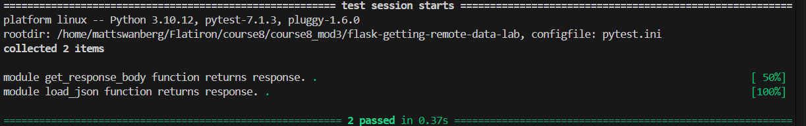

````markdown
# Getting Remote Data Lab

## Description

This project demonstrates how to retrieve remote data from an API using Python. The application uses a `GetRequester` class to send an HTTP GET request to a provided API endpoint, retrieve the response body, and convert JSON response data into Python objects.

This lab provides practice working with HTTP requests, remote API data, JSON parsing, and object-oriented programming in Python.

## Learning Objectives

This project demonstrates how to:

- Build a Python class that interacts with a remote API.
- Send HTTP GET requests using the `requests` library.
- Retrieve response data from an API endpoint.
- Convert JSON response data into Python objects using the `json` module.
- Organize API-related functionality into reusable class methods.
- Test API functionality using `pytest`.

## API Endpoint

The application retrieves data from the following endpoint:

```text
https://learn-co-curriculum.github.io/json-site-example/endpoints/people.json
````

The endpoint returns JSON data containing information about people and their occupations.

## Project Structure

```text
.
├── CONTRIBUTING.md
├── LICENSE.md
├── Pipfile
├── Pipfile.lock
├── README.md
├── lib
│   ├── GetRequester.py
│   └── testing
└── pytest.ini
```

## GetRequester Class

The primary functionality of the application is contained in the `GetRequester` class located in:

```text
lib/GetRequester.py
```

### Initialization

A `GetRequester` instance is initialized with a URL. The URL is stored on the instance so it can be used when making an HTTP request.

### `get_response_body()`

The `get_response_body()` method:

1. Sends an HTTP GET request to the URL stored by the `GetRequester` instance.
2. Retrieves the raw response content.
3. Returns the response body as bytes.

### `load_json()`

The `load_json()` method:

1. Calls `get_response_body()` to retrieve the remote data.
2. Uses Python's `json` module to parse the JSON response.
3. Returns the converted JSON data as a Python object.

## Technologies Used

* Python
* Requests
* JSON
* Pipenv
* Pytest
* Git
* GitHub

## Installation

Fork and clone the repository to your local machine.

Navigate into the project directory:

```bash
cd flask-getting-remote-data-lab
```

Install the required dependencies:

```bash
pipenv install
```

Enter the project's virtual environment:

```bash
pipenv shell
```

## Running the Tests

From the root directory of the project, run:

```bash
pytest
```

To stop the test suite after the first failure while troubleshooting, run:

```bash
pytest -x
```

A successful test run confirms that the application can retrieve the expected response data and correctly convert the JSON response into Python data.

## Application Flow

The application follows this general process:

```text
API Endpoint
     ↓
GetRequester
     ↓
get_response_body()
     ↓
HTTP GET Request
     ↓
Raw Response Content
     ↓
load_json()
     ↓
JSON Parsing
     ↓
Python Data
```

## Screenshot



## Author

Created by Matthew Swanberg as part of Course 8 Module 3 (Retrieving Remote Data from an API)